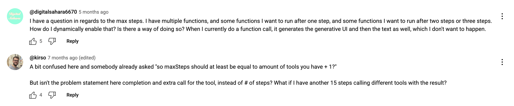
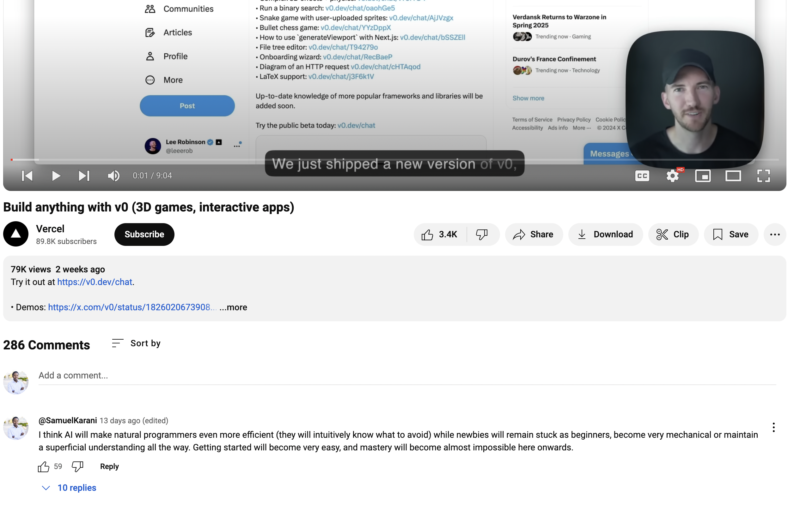

AI Sugar is built for **Typescript/Node.js**

## What is AI Sugar?

What if you could run code like this in Typescript?

```
const result1 = await ai.sort({
  array: ["green", "red", "blue", "yellow"],
  prompt: "rainbow color order",
  schema: z.string(),
});
// ["red", "yellow", "green", "blue"]
```

With this new and free open source library - now you can!

AI Sugar is a collection of syntactic sugar function helpers for working with AI apis. This initial version is built on top of [Vercel AI SDK](https://ai-sdk.dev).
Kinda like "lodash for AI" for those old enough to remember it - or Underscore!

What's more, it allows you break out of the declarative model of Vercel's AI SDK into an imperative one particularly when building tools.

## Why?

Letting the AI make critical (biiig) control flow decisions like deciding when to call your tools can be unreliable, inconsistent or unpredictable.

It might be better to rather let the AI make smaller decisions more reliably so that we can structure our program as we are normally used to. This makes programming with AI less declarative and more imperative which might be the more ideal or preferred pattern.

This allows us to use familiar syntax like `if`/`else` when dealing with AI requests and responses.

```
const prompt = "What happened in San Francisco last week?";
if (await ai.knows({ prompt: prompt })) {
  //  continue prompting AI
} else {
  // use web search api
}
```

## `maxSteps` is kinda weird

When it comes to building tools, Vercel's `maxSteps` forces you into a somewhat esoteric declarative model without recourse. (Can you imagine what kind of loop is being forced to iterate with `maxSteps`?)

This library aims to alleviate or complement this approach by facilitating an imperative one.

For example, this snippet from the [official docs](https://ai-sdk.dev/cookbook/node/web-search-agent#openai-responses-api) doesn't even work at the the time of this writing i.e. the tool is not being called.

```
const { text, sources } = await generateText({
  model: openai.responses('gpt-4o-mini'),
  prompt: 'What happened in San Francisco last week?',
  tools: {
    web_search_preview: openai.tools.webSearchPreview(),
    // doesn't work in my testing at the time of writing
  },
});
```

Additionally, here are some of the top comments for the [Vercel video](https://youtu.be/ZmPGr1WHS_s?si=wrZ8C8q9QLIO986n) that introduced composing tools with `maxSteps` - most of which expressed some confusion, critique or disapproval of the api.




## What's in the package?

A set of 'primitive' functions, most of which allow you to use conditional statements: `isTrue`, `knows`, `can` `shortAnswer` `complete`

```
await ai.isTrue({ prompt: "goat is a mammal" }); // true
await ai.isTrue({ prompt: "goat is a fish" }); // false

await ai.shortAnswer({ prompt: "(60 + 10) / 2" }); // 35
await ai.shortAnswer({ prompt: "who is the president of the united states?" }); // Joe Biden (obviously out of date)

await ai.can({ prompt: "Get the weather for a location" }); // false
await ai.can({ prompt: "Explain to me Einstein's theory of general relativity" }); // true

await ai.complete({ prompt: "who let the dogs out?" }); // Who, who, who, who!
await ai.complete({ prompt: "cry havoc " }); // and let slip the dogs of war!
await ai.complete({ prompt: "what question can you never answer yes to?" }); // "Are you asleep?"

```

A set of prompt argument validators: `isCondition`, `isOrder`

```
await ai.isCondition({ prompt: "chicken is a fish" }); // true
await ai.isOrder({ prompt: "most recent first" }); // true
```

A set of creator functions: `createText`, `createObject`, `createArray`. `createText` is the same as `shortAnswer`.

```
const book = await ai.createObject({
  prompt: "a popular book",
  schema: z.object({
    title: z.string(),
    author: z.string(),
    genre: z.string(),
  }),
}); // { "title": "To Kill a Mockingbird", "author": "Harper Lee", ... }

const authors = await ai.createArray({
  prompt: "best russian authors",
  schema: z.string(), // can be an object
}); // [ 'Leo Tolstoy', 'Fyodor Dostoevsky', ... ]
```

A set of predicate functions that evaluate a prompt with either a single value or an array (for every item in the array) to return a boolean or an array of booleans: `isTrueValue`, `isTrueArray`

```
const value = "goat";
await ai.isTrueValue({ value: value, prompt: "is a mammal" }); // true
await ai.isTrueValue({ value: value, prompt: "is a fish" }); // false

await ai.isTrueArray({
  array: ["goat", "fish", "monkey", "chicken"]
  prompt: "is a mammal",
}); // [true, false, true, false]
```

A set of array functions with a condition prompt instead of a predicate/comparator: `every`, `filter`, `find`, `findIndex`, `some`, `toSorted`.
The callback is simply a natural language condition that can evaluate to either true or false.
Each function exposed 3 versions:

- _serial_ runs the predicates one at time while processing the result - uses the suffix **Serial**
- _concurrent_ runs the all predicates at the same time then processes the result afterwards - uses the suffix **Concurrent**
- _generate_ uses the AI to create the result - uses the suffix **Generate** and in some cases requires a schema be provided

The concurrent version is the default i.e. `find` is the same as `findConcurrent`

```
const result4 = await ai.filter({ // same as filterConcurrent
  array: ["red", "white", "green", "blue", "yellow", "black"],
  prompt: "is a rainbow color",
}); // ["red", "green", "blue", "yellow"]

const result5 = await ai.filterGenerate({
  array: ["red", "white", "green", "blue", "yellow", "black"],
  prompt: "is a rainbow color",
  schema: z.string() // requires item schema
}); // ["red", "green", "blue", "yellow"]
```

All the functions above are exposed using the javascript factory function pattern:

```
const ai = sugar({ model: openai.responses("gpt-4o") });
```

Internally a collection of prompts power each function. As a result we collect telemetry data in order to improve the efficacy of our prompts. You can opt out of sharing any data with us by becoming a sponsor at whatever amount you are comfortable with. This will also make your functions slightly faster (5-10%). Details are in the #sponsors section down below.

In addition to `model` you can pass other parameters supported in the AI SDK like `maxTokens`, `maxRetries`. Any arguments passed to a function override the global options passed to `sugar` function:

```
const ai = sugar({
  model: openai.responses("gpt-4o"),
  maxRetries: 2,
  maxTokens: 1000,
}); // options later overridden
const result1 = await ai.shortAnswer({
  prompt: "who is the president of the united states?",
  model: openai("gpt-4o-mini"),
  maxRetries: 1,
  maxTokens: 100,
}); // options take precedence

```

<!-- Additionally you can also pass the following arguments: -->

## Tool use examples [source](https://ai-sdk.dev/cookbook/node/web-search-agent#exa)

### example 1

Given this prompt: `const prompt = "What happened in San Francisco last week?";`

Vercel's AI SDK wants you to code like this:

```
// 20.196s
// often returns { text: '', sources: [] } despite tool being called
const { text, sources, toolCalls, toolResults } = await generateText({
  model,
  prompt: prompt,
  tools: {
    // each tool comes with a management and "orchestration" cost
    webSearch: tool({
      description: "Search the web for up-to-date information", // more prompting
      parameters: z.object({
        query: z.string().min(1).max(100).describe("The search query"), // could be paraphrased
      }),
      execute: async ({ query }) => {
        return searchExa(query); // could be called multiple times
      },
    }),
  },
  maxSteps: 3, // requires guessing/approximating
  toolChoice: "required", // could still be ignored
});
```

Instead you can code like this:

```
// 8.899s
// { text: 'Last week in San Francisco, two major events took place. Firstly, ...', sources: [] }
if (await ai.knows({ prompt: prompt })) {
  const { text, sources } = await generateText({
    model,
    prompt: prompt,
  });
} else {
  const results = await searchExa(prompt);
  const { text, sources } = await generateText({
    model,
    system: prompt + " Use the information provided",
    prompt: JSON.stringify(results),
  });
}
```

### example 2

Prompt: `const prompt = "who is the current president of the united states?";`

Vercel way:

```
// 9.439s
// in my testing, despite tool being called, returns empty text and no sources
const { text, sources } = await generateText({
  model,
  prompt: prompt,
  tools: {
    webSearch: tool({
      description: "Search the web for up-to-date information",
      parameters: z.object({
        query: z.string().min(1).max(100).describe("The search query"),
      }),
      execute: async ({ query }: { query: string }) => {
        console.log("query:", query);
        // some of the queries from testing
        // query: current president of the United States 2023
        // query: current president of the United States
        // query: current president of the United States 2023
        const { answer, citations } = await exa.answer(query); // web search grounding api
        return { text: answer, sources: citations.length };
      },
    }),
  },
  maxSteps: 3,
  toolChoice: "required",
});
```

Our way:

```
//  2.455s
// { text: 'Donald J. Trump is the current president of the United States...', sources: 8 }
if (await ai.knows({ prompt: prompt })) {
  const { text, sources } = await generateText({
    model,
    prompt: prompt,
  });
  return { text, sources: sources.length };
} else {
  const { answer, citations } = await exa.answer(prompt); // web search grounding api
  return { text: answer, sources: citations.length };
}
```

### Evaluating this approach:

More accurate and more reliable from our testing - tools may return nothing, may not be called at all returning older or stale information as a result.

Secondly, you now have to deal with maintaining the tool - its parameter schemas, description prompts and the execution logic.

Lastly, composing tools in this way comes with an orchestration cost where you need to make sure all your prompts & tools can work together harmoniously - that one prompt/tool doesn't override or clash with another one. It forces you have to always have the entire program in mind rather than partitioning and dealing with different parts independently.

### Pros of our approach:

- More control - execution becomes much less of blackbox
- More predictable flow - model is not "overloaded" or "overwhelmed" with many instructions or prompts
- Less prompting hence less prone to misunderstandings or hallucinations from the LLM
- Tools don't work with structured or streaming objects - our approach can handle such cases
- Less generic and complex prompts - simpler and more specific prompts
- In my testing, has always been faster than using `maxSteps` (2.5 - 5X faster)

### Cons of our approach:

- Could potentially have more (verbose) code - but this has not been the case in my testing
- You lose the "magic" and delegation of declarative approach
- Probably not the best approach for building "agents" or programs with generic goals or wide scopes

## Inspiration for this library

Composing tools the "Vercel way" can work great for some cases.
I can see it working well for assistants and other general use cases.
But not everybody wants to use AI to build chat apps and voice bots. (Doesn't the world already have enough of those?)
There are many people with plenty of small narrow use cases often at the level of function calls who would benefit from injecting some useful AI into different parts of their applications without needing to accept an entire paradigm shift to even started.
Being one of those people, I believe this library could be a path there. I think there are plenty of people who would simply appreciate sprinkling AI in different their programs without being forced to adopt a new programming model wholesale. This is AI retail.

If this library is well received, then local LLMs become even more important towards making this style of AI computing more cost efficient.

## Thanks for reading

I welcome your input, suggestions, feedback.

Check out the following related libraries that I also built with this release. Both are used internally in this library.

[arrays-sugar](https://github.com/samuelkarani/arrays-sugar) A set of purely functional array methods with async callbacks: `everyAsync`, `filterAsync`, `findAsync`, `findIndexAsync`, `someAsync`:

```
const array = [1, 2, 3];
array.findIndex(async (number) => number === 2) // 0 ❌
findIndex(array, async (number) => number === 2) // 1 ✅
```

[zod-sugar](https://github.com/samuelkarani/zod-sugar) Zod Sugar is basically reverse zod i.e. creates a zod schema from any value:

```
const schema = createZod({ foo: "bar", baz: 1 });
// z.object({ foo: z.string(), bar: z.number() });
schema.safeParse({ foo: "bar", baz: 1 }).success // true
```

### Where you can find me

You can reach me via email at samuel.karani@berkeley.edu

I occasionally inhabit [Twitter](https://x.com/samuel_karani)

### What I'm building


Find the best alternatives with one click. Discover similar websites, tools and services instantly while browsing. Never miss out on better options again.

[Check out Similarly](https://chromewebstore.google.com/detail/similarsites+-discover-al/dhahadpjpmphckgebnikgpdhaolcojdg)

## Become a sponsor - starting 5$

Support us if you would like this work to continue! Sponsorship allows development and maintenance of all 3 sugar libraries: [ai-sugar](https://github.com/samuelkarani/ai-sugar), [arrays-sugar](https://github.com/samuelkarani/arays-sugar) and [zod-sugar](https://github.com/samuelkarani/zod-sugar).

We are currently waiting for approval to be part of Github Sponsors program. In the meantime you can support us on either
[Patreon](patreon.com/samuelkarani) or [BuyMeACoffee](coff.ee/samiezkay)

You can becoming a sponsor at whatever amount you are comfortable with.
For individuals, starting $5 monthly or for a one-time payment.
For companies, starting $500 monthly or for a one-time payment.

As a sponsor you can have yours or your organization's name/photo featured in our upcoming sponsors list tiers.
The tiers are updated every month, showing the total contributions for every individual and company.

### Don't read this:

My comment on the v0 launch video on YouTube was one of the most liked - yikes!


Guillermo Rauch, Vercel's CEO responded to my question about Zeit (Vercel) way back in the day over on Twitter

